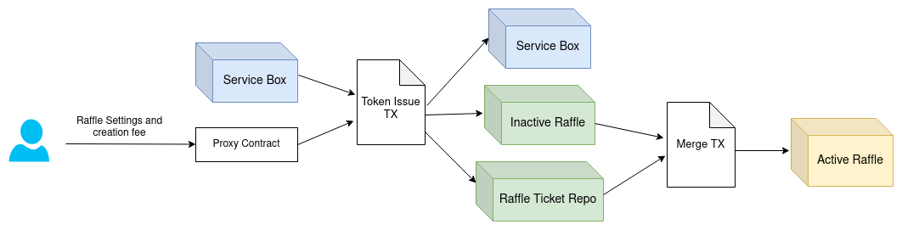
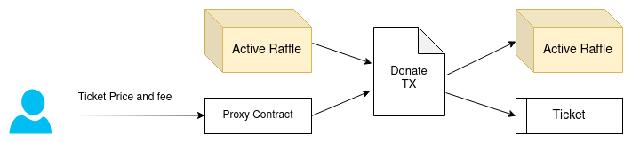
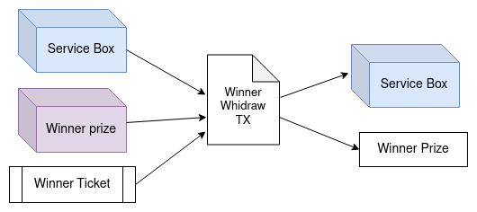
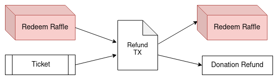
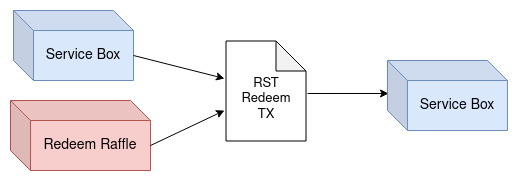

# ErgoRaffle

A raffle is a crowdfunding service that aims to enable anyone to raise enough money needed for a project. The project can be a direct donation to a charity, an academic or business plan, or anything else the creator can convince people to part with their hard-earned ERG for.

As a bonus, after finishing the raffle, a lottery takes place, and a lucky participant wins the raffle reward. Each raffle has a deadline and raising goal, if the raffle reaches its goal within the deadline the raffle is successful and the project, winner, and service will charge accordingly. Otherwise, the raffle is unsuccessful, and it will pay back all collected funds to the raffle participants. If the raffle achieves its goal before the deadline it will continue operating till the deadline and it can be overfunded.

Although there is an example for crowdfunding scripts in the ergo whitepaper, we didn’t use that idea, since it has some problems. For example, since it collects all donations in one transaction and it’s limited to inputs and outputs of one transaction, it can not handle a large number of participants. It also didn’t have details on special cases and participation policies.

In the following, we present our idea that is based on UTXO based Multi-Stage contracts (a self-replicating box that collects the participant funds).

## Raffle Components

Before explaining the main idea and procedure of the raffle, it's better to get familiar with its components:

### Tokens

1. **Raffle Service NFT (RSNFT):** It's a unique token in the raffle service box, Since the raffle service box contains all system settings, it's a piece of sensitive information, so raffles will verify the service box with its NFT.
2. **Raffle Service Token (RST):** Each legitimate raffle created by our service should be distinguishable from other boxes with the same contract. So each legitimate raffle has an RST. The raffle service box contains a bunch of RSTs at the beginning.
3. **Raffle ticket token:** Each raffle collects funds by selling the raffle tickets. Thus, each raffle has its special token that is issued when the raffle is created and it will be burned after the raffle deadline.

### Contracts

1. **Raffle Service**: It's a unique box containing all service information, and also the RSTs. It's distinguishable in the network with RSNFT.
2. **Inactive Raffle**: It's a valid raffle with the RST token but without its ticket tokens.
3. **Raffle Ticket Repo**: The raffle ticket tokens are issued in the box with this contract.
4. **Active Raffle**: Inactive raffle will be activated after it receives its ticket tokens. The *inactive raffle* and *raffle token repo* are merged to construct the active raffle.
5. **Redeem Raffle**: If the raffle can not achieve its goal within the deadline, the raised money is sent to this contract to refund the participants.
6. **Ticket**: Participants will donate to each raffle by buying its tickets. Each ticket has some raffle ticket tokens that show the ticket's worth.
7. **Winner**: The raffle lucky winner information and prize will be sent to this contract.
8. **Proxy Contracts**: There are two proxy contracts designed for two kinds of payments: creation and donation payments.

## Raffle Life Cycle

Each raffle has a deterministic life cycle and passes through different stages based on its status.
The raffle life cycle has four main phases: creation, donation, successful raffle withdrawal, and refund.

### Phase 1: Raffle Creation

In the beginning, to start a new raffle, the raffle creator just needs to set some parameters such as charity and winner percentage, charity address, deadline, goal, and ticket price. Then pay the raffle creation fee to create the active raffle box. The creation process is done in three steps:

1. **Payment**: The raffle creator must pay the required fee to the raffle creator proxy contract (This step can be passed by creating the raffle throw the raw scripts by an advanced user).

2. **Token Issue**: Each raffle has a set of unique tokens for itself. In this step, the creator payment is spent to issue the raffle ticket tokens. At the same time, the raffle box is created by paying one RST to the raffle box. Thus this step has two outputs, *Raffle Ticket Repo* box and *Inactive Raffle* box.

3. **Merge**: The outputs of the previous step merge to create the *Active Raffle* box.

### Phase 2: Raffle Donation

The *Active Raffle* starts its operations by selling the tickets. Raffle participants can donate to the raffles by buying tickets. The raffle box can be spent in this phase only if the first output of the transaction is a self-replicated box and this new raffle box Erg values increase based on the number of sold ticket tokens. The second output of the mentioned transaction is the ticket that can win the lottery proportional to its worth (number of owning ticket tokens).

As you can see at each time there is only one valid raffle box for each raffle that contains the RST and the remainder of its ticket tokens. Each ticket has two important pieces of information, the participant's address, and the ticket range. Ticket range length is equal to the ticket counts and the range start point is the number of sold tickets before this donation. Thus each ticket range is a unique fixed range. We will use this range to identify the winner in the following phases.

After reaching the raffle deadline the donation will be closed. Then based on the raffle raised money and its goal, two different scenarios will happen. If the raffle has raised enough money within the deadline, it will be marked as successful and funded and Phase 3 will be started, otherwise, the raffle enters the fourth phase.

### Phase 3: Successful Raffle Withdrawal

If the raffle reaches its goal, the raffle-raised money will be split between the charity, winner, and service based on their proportions. This phase is done in two steps:

1. The winner selection algorithm runs and the winner is announced in the first step, while charity and service will be charged accordingly. The raffle RST and remaining raffle ticket tokens are going to the winner prize box in this step.

2. The winner price and its Id are stored in the winner contract in the previous step, then the winner contract is spent to fund the raffle winner based on the related information stored in its ticket. The RST is redeemed to the service box and the raffle ticket tokens will burn in this transaction.

You can read more about the random winner selection algorithm in the next section.

### Phase 4: Refunding
In case of an unsuccessful raffle, all the donors must be refunded. The refunding procedure is somehow like the donation. The refunding is done in three steps:

1. All raised money is transferred from the active raffle contract to the redeem raffle contract.
2. The refunding process starts, and the raffle refunds all the tickets one by one. In each step, the ticket tokens stored in the ticket box are redeemed to the raffle box, and the donation is paid back to the participant's address.

3. When all ticket tokens collected from the ticket boxes the RST is redeemed to the service box and the ticket tokens will be burnt out.

## Raffle Winner

As mentioned above, if the raffle is completed successfully, it will create a new box named winner box. We had different ideas for this step since it’s the most important point in the raffle protocol. Finally, we decided to implement one of the ideas but we briefly describe our ideas here.

### Pseudo-Random Number

With any approach, we need to have a random number to determine the winner. Since we don’t have access to a random number generator on the ledger, we should use the available pseudo-random numbers on the chain.

1- **Block Id**

For example, the previous block id is a number that can be used as a random number since it’s out of the control of the participants. As the PoW puzzle influences the block id, a participant can not jointly solve the PoW puzzle and optimize the generated id to influence the raffle result. If a party owns x percent of total computation power and he mines the last block related to this raffle, we estimate that the probability of his sabotage raffle result influence is less than x^4. (Since they are Poisson random variables you can write the mathematical formulas with Poisson process relations). However, this value is not that small.

2- **Oracle Box Id**

Another random number that can be used here is the Oracle Box Ids. Since this Id updates frequently in specified periods, and it’s not controllable by the participants, it can be used as the random number that identifies the winner.

3- **Random Number with Participation**

Another way to find a truly random number is by asking each participant to introduce a random number and aggregate all these numbers. It can be done by asking the participants to commit the hash of their random numbers in the first phase, and reveal it in the final phase.

Since the previous block id can be influenced by the miners with small probability and the last method increases the costs and complexity we decided to use the Oracle Box Id as the pseudo-random number in this phase.

### Selection Algorithm

With owning a pseudo-random number we need to define a selection algorithm to select the winner. We studied algorithms that can support weighted chances; since one may buy many tokens with one ticket and he should have more probability of winning the raffle.  As already discussed, each ticket has a unique range hardcoded in its registers; then, we can use these unique numbers to find the winner.

1- **Mod**

A simple approach for finding the winner is to compute the remainder of the division of the random number by the total number of sold tokens. Then we can check that this number is within the range of which ticket. In other words, the winner box can be spent by the one who provides a ticket that the winning number is within its valid range.

2- **Minimum Hash**

In this algorithm, we define the winner as “the participant who has the minimum `hash(randomSeed | nonce)`” where the `|` means concatenation and the `nonce` is a number in the valid range of the participant’s ticket.

To find the winner, we are not required to compute all these hashes, and participants are responsible for running the related computations themselves. To aggregate the results, each participant passes the minimum value he could compute with its ticket range to the winner box. The winner box updates the winner if the given value is less than the value it already has.
In other words, the winner box is a self-replicating box before the deadline, and it is protected with a script that ensures only a participant with a hash value less than the current winner hash value can spend it. Then the participant can change the winner information within the box. Finally, after the deadline, the actual winner can spend the whole amount.

The winner box should validate the computation done by each participant; thus, as well as the ticket the nonce that created the least hash value for each participant passed to the winner box via a context variable.

3- **Sortition Algorithm**

Some algorithms use the secret key of the participant to claim that is he the winner or not. A famous example of these algorithms is the Algorand sortition algorithm. Although this is a probabilistic algorithm and may have more than one winner we can use this algorithm to mitigate some attack vectors, especially the one we presented in the block id random number approach. We can use the previous idea along with the sortition algorithm to solve the problem of more than one winner.

After all, we decided to implement the first approach because:

1. It has the least network costs and fees, and it’s simplest to implement. The simpler, more secure!
2. Minimum hash idea increases the randomness of the result, but this growth is negligible compared to the network computation powers.
3. Minimum hash idea, needs the client full control over his ticket since anyone else may burn his ticket by providing an improper context number.
4. The sortition algorithm needs the client secret key in computations, which is not a desirable requirement in a dApp setting.

## More Technical Details

### Proxy Contracts

Since the raffle creation and donation needs direct payment from users, we have used proxy contracts for all payments. The proxy contracts eliminate the need of revealing participants' secret keys to the raffle dApp. Moreover, the proxy contracts ensure that the payment only can be used for the designed purpose, so anyone can trust to pay to the contracts.

### Decentralization

The main feature of our dApp is that the whole process is done using the contracts, and no external power can alter the raffle life cycle, even the ErgoRaffle system itself. The system is designed such that anyone can create new raffles or donate to raffles using the raw scripts, and the raffle service functioning is disjoint from the raffle service backend. Although the service backend and frontend are designed in such a way that anyone with any amount of knowledge can use the service.

### Transaction Chaining

As we had seen almost all raffle procedures were sequential and they need to be done step by step. However, we have used transaction chaining in the raffle backend to address the high volume of requests in a short period. all simultaneous donation and creation requests are chained together and sent to the network. And all ticket refunding in the fourth phase is done in one step with the help of chaining.

### Addresses

All addresses in our system are fixed, and all needed information is stored in box registers. As we have used the self-replicating box idea in our system design, it requires the addresses to stay fixed during the transitions. Moreover, we needed to show the raffle information to the participants, since all data is stored on the registers, the only needed process is to search the raffle box in the network and read its registers.

